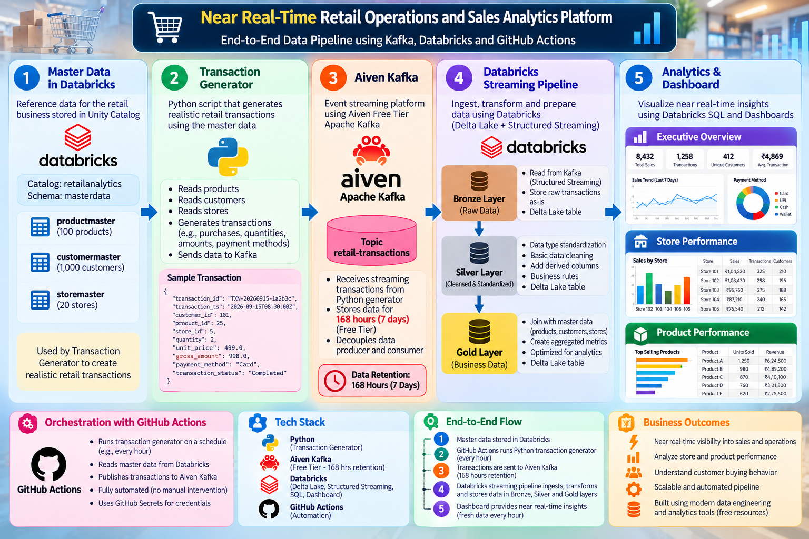
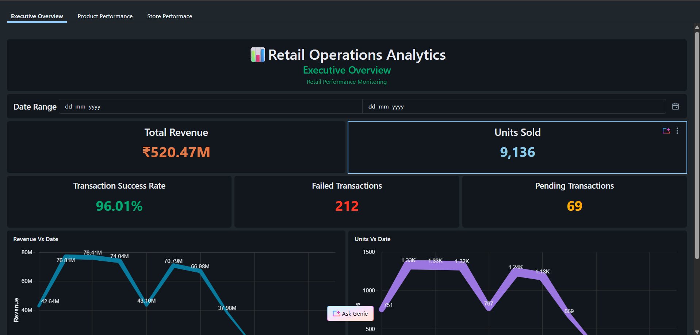
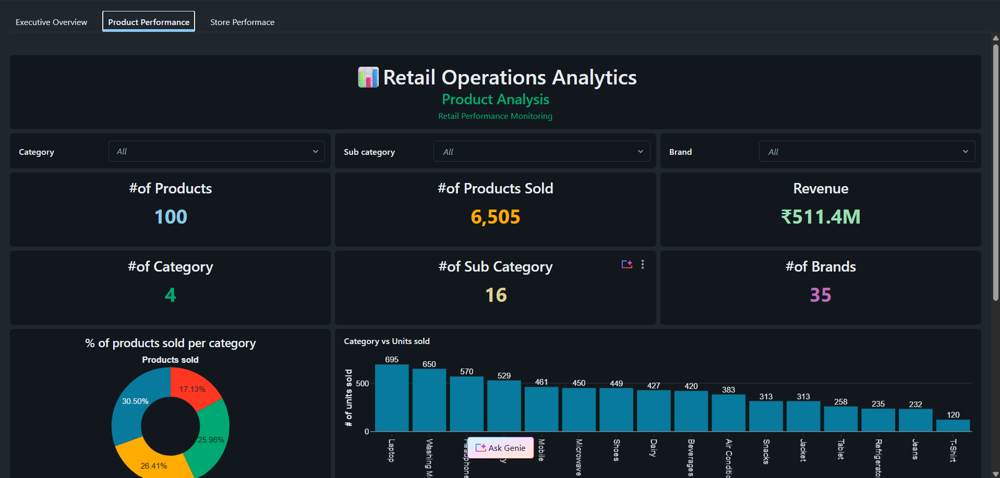
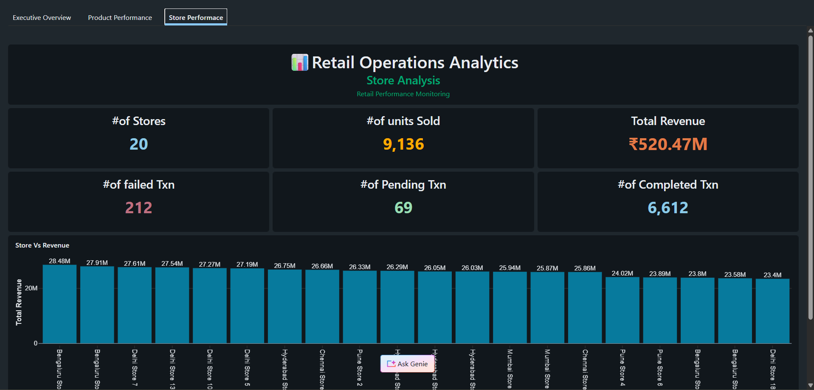

# 🛒 Near Real-Time Retail Operations & Sales Analytics Platform

## 📌 Project Overview

This project demonstrates an end-to-end near real-time retail analytics platform built using modern Data Engineering and Analytics technologies.

The platform simulates retail transactions, streams them through Apache Kafka, processes them using Databricks Structured Streaming, and implements a Medallion Architecture (Bronze → Silver → Gold) for analytics consumption.

The final curated datasets power interactive Databricks dashboards that provide business insights into sales performance, product trends, and store operations.

---

## 🎯 Business Problem

Retail organizations require timely visibility into:

* Sales performance
* Product demand
* Store performance
* Operational health

Traditional batch reporting introduces delays in decision-making.

This project addresses that challenge by creating a near real-time analytics pipeline that continuously ingests and processes transaction data and serves business-ready insights.

---

# 🏗️ Architecture



### Data Flow

```text
Master Data
    ↓
Python Transaction Generator
    ↓
GitHub Actions (Hourly)
    ↓
Aiven Kafka
    ↓
Kafka Topic: retail-transactions
    ↓
Databricks Structured Streaming
    ↓
Bronze Layer
    ↓
Silver Layer
    ↓
Gold Layer
    ↓
Databricks SQL Dashboards
```

---

# ⚙️ Technology Stack

| Layer           | Technology                      |
| --------------- | ------------------------------- |
| Programming     | Python                          |
| Source Control  | GitHub                          |
| Automation      | GitHub Actions                  |
| Messaging       | Apache Kafka (Aiven)            |
| Data Processing | Databricks Structured Streaming |
| Storage         | Delta Lake                      |
| Governance      | Unity Catalog                   |
| Data Modeling   | Medallion Architecture          |
| Analytics       | Databricks SQL                  |
| Visualization   | Databricks Dashboards           |

---

# 📂 Project Structure

```text
retail-streaming-analytics/
│
├── transactiongenerator.py
├── kafkaproducer.py
├── readdatabricks.py
│
├── .github/
│   └── workflows/
│       └── transaction-generator.yml
│
├── notebooks/
│   ├── bronze_layer
│   ├── silver_layer
│   └── gold_layer
│
├── dashboards/
│
├── docs/
│   ├── architecture/
│   └── screenshots/
│
└── README.md
```

---

# 📥 Data Ingestion

## Master Data

The platform uses retail master data:

### Product Master

Contains:

* Product ID
* Product Name
* Category
* Sub Category
* Brand
* Unit Price

### Customer Master

Contains:

* Customer Information

### Store Master

Contains:

* Store Information

Master data is stored in Databricks Unity Catalog and retrieved by the transaction generator.

---

# 🔄 Transaction Generation

A Python-based transaction generator creates synthetic retail transactions.

Each transaction contains:

```json
{
  "transaction_id": "TXN-20261001-123456",
  "transaction_ts": "2026-10-01T12:00:00Z",
  "customer_id": "CUST001",
  "product_id": "PROD001",
  "store_id": "STORE001",
  "quantity": 2,
  "unit_price": 1200,
  "gross_amount": 2400,
  "payment_method": "UPI",
  "transaction_status": "COMPLETED"
}
```

Transactions are automatically generated every hour through GitHub Actions.

---

# 🚀 Streaming Layer

## Apache Kafka (Aiven)

Transactions are published to:

```text
Topic:
retail-transactions
```

Kafka acts as the streaming ingestion layer and retains data for:

```text
168 Hours (7 Days)
```

---

# 🥉 Bronze Layer

Purpose:

Store raw transaction events exactly as received from Kafka.

Characteristics:

* Append-only
* Raw ingestion
* Minimal transformation
* Streaming source for downstream processing

---

# 🥈 Silver Layer

Purpose:

Clean and standardize transactional data.

Transformations include:

* Data type standardization
* Data quality validation
* Column normalization
* Business-ready transactional dataset creation

---

# 🥇 Gold Layer

Purpose:

Create business-focused analytical datasets.

Gold Tables:

### Daily Sales

```text
gold.daily_sales
```

Contains daily aggregated metrics.

---

### Product Performance

```text
gold.product_performance
```

Contains product-level sales and revenue analytics.

---

### Store Performance

```text
gold.store_performance
```

Contains store-level sales and revenue analytics.

---

# 📊 Analytics & Dashboards

## Executive Overview Dashboard

Key Metrics:

* Total Revenue
* Units Sold
* Transaction Success Rate
* Failed Transactions
* Pending Transactions

Visualizations:

* Revenue Trend
* Units Sold Trend

---

## Product Performance Dashboard

Insights:

* Product Revenue
* Products Sold
* Category Performance
* Sub Category Performance
* Brand Distribution

---

## Store Performance Dashboard

Insights:

* Store Revenue
* Units Sold by Store
* Store Ranking
* Store Contribution Analysis

---

# 🔐 Governance

Unity Catalog is used for:

* Centralized data governance
* Schema management
* Table organization

Example Namespace:

```text
retailanalytics.masterdata
retailanalytics.bronze
retailanalytics.silver
retailanalytics.gold
```

---

# 🔄 Automation

GitHub Actions automates transaction generation.

Schedule:

```cron
40 * * * *
```

Runs every hour at the 40th minute (UTC).

---

# 📈 Key Learnings

During this project I gained hands-on experience with:

* Apache Kafka Producers
* Event Streaming Concepts
* Databricks Structured Streaming
* Delta Lake
* Medallion Architecture
* Unity Catalog
* Databricks SQL
* Dashboard Development
* GitHub Actions Automation
* End-to-End Data Pipeline Design

---

# 📸 Project Screenshots

## Architecture


## Executive Dashboard



## Product Dashboard



## Store Dashboard



---

# 👨‍💻 Author

**Aravind A**

* Vellore Institute of Technology (VIT)
* Data Engineering & Analytics Enthusiast
* Databricks Data Analyst Associate Certified

---
